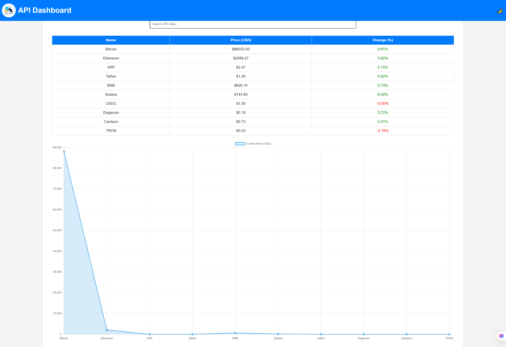

# API Dashboard

## Overview
The **API Dashboard** is a web application that displays real-time cryptocurrency data, allowing users to monitor price changes and percentage variations. The application features a search bar to filter API data and provides a visually appealing and responsive interface.

## Features
- 📊 **Real-time Data Fetching**: Displays live cryptocurrency prices and percentage changes.
- 🔍 **Search Functionality**: Users can filter API data to find specific cryptocurrencies.
- 🎨 **Responsive Design**: The interface is designed to be fully responsive across different screen sizes.
- 🌙 **Dark Mode Toggle**: Allows users to switch between light and dark themes.


## Technologies Used
- **HTML**: Structure of the web application.
- **CSS (Tailwind CSS)**: Styling and responsive design.
- **JavaScript**: Handles API fetching and dynamic UI interactions.
- **Fetch API**: Retrieves real-time cryptocurrency data from an external API.

## Installation & Setup
1. Clone the repository:
   ```sh
   git clone https://github.com/Suhaibmuhd01/api-dashboard-visualizer.git
   ```
2. Navigate to the project folder:
   ```sh
   cd api-dashboard
   ```
3. Open `index.html` in a browser or use Live Server in VS Code.

## Usage
1. Open the dashboard in your browser.
2. View live cryptocurrency data.
3. Use the search bar to filter data.
4. Toggle between light and dark modes.

## API Source
The real-time cryptocurrency data is fetched from:
- **CoinGecko API** (or any other API source you use)

## Screenshots


## Author
Suhaib Muhammad Babangida
## Live preview 
[Live Demo](https://api-dashboard-visualizer.vercel.app/)
## Contributing
Feel free to fork the repository and submit pull requests to enhance the project!

## License
This project is open-source under the **MIT License**.

